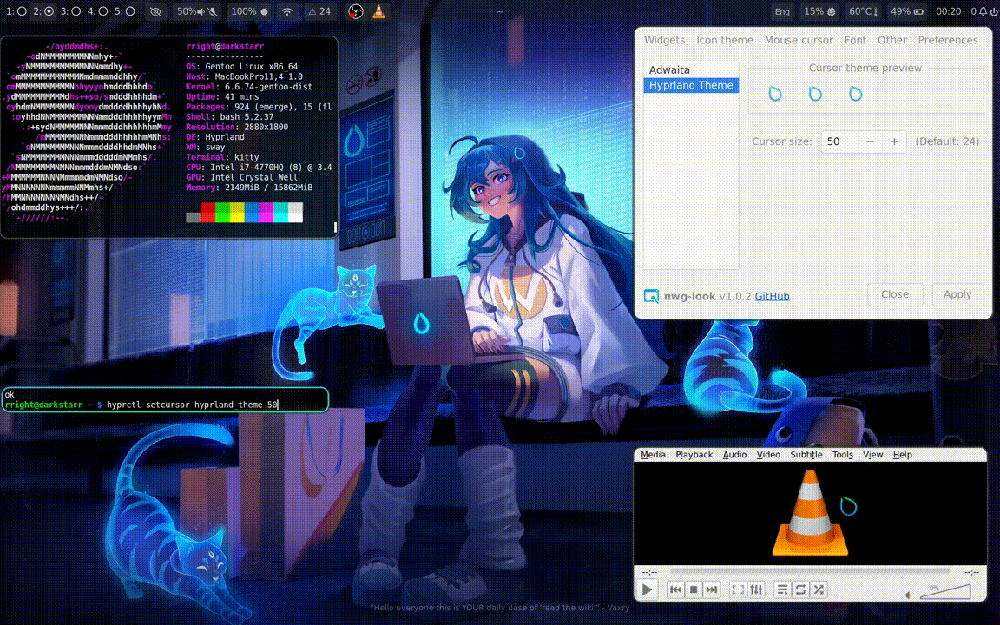

 Hyprland Logo Cursor Theme
==============================

A scalable custom cursor theme based on the built-in Hyprland **logo icon** — provided in both `XCursor` and `Hyprcursor`formats.

<div align='center'>

</div>

✨ Features
----------

✅ Works across **Wayland**, **GTK**, **Hyprland**, **QT**, and **XWayland** — they all bow before your cursor\
✅ Fully scalable: includes `24`, `32`, `48`, `64`, and `96` px images\
✅ Smooth sailing on **Gentoo** (and probably Arch, but we're keeping it classy 😏)\
✅ Compatible with `kitty`, `nwg-look`, `Waybar`, `VLC`, etc.

> *"Why doesn't it scale?"* Because XCursor is picky. It wants *multiple sizes*. Don't ask why. Just give it what it wants.

🔧 Installation
---------------

### XCursor

1.  Clone/download the repo or just the `cursors/` dir.

2.  Place everything into:\
    `~/.local/share/icons/hyprland_theme/`

3.  Add soft links for at least:\
    `default`, `left_ptr`, and `arrow`

4.  Place the `index.theme` in the same folder.

5.  (Optional) Build from source:

    ```bash
    xcursorgen hyprland_logo_cursor.conf hyprland_theme
    ```
6.  Set the theme:\
    `export XCURSOR_THEME=hyprland_theme`\
    (or add to `hyprland.conf`)

### Hyprcursor

1.  Place the `hyprcursor/` structure into:\
    `~/.local/share/icons/hyprcursor_logo/`

2.  Place `manifest.hl` there too.

3.  Set in config:\
    `export HYPRCURSOR_THEME=hyprcursor_logo`\
    (or `hyprland.conf`)

🤯 Naughty Libs & Fixes
-----------------------

-   **GTK**: Use `nwg-look`, or run:\
    `gsettings set org.gnome.desktop.interface cursor-theme hyprland_theme`

-   **QT (like VLC)**:\
    Add: `export XCURSOR_PATH=~/.local/share/icons/`

🎨 Designers Wanted
-------------------

This is just a **proof of concept**. We need a full theme like Bibata or Breeze, based on the Hyprland logo style. Got design chops? Let's collaborate!

🙏 Credits
----------

This cursor was **ripped straight from the Hyprland source code**, where it lived as a mysterious array of raw numbers. Yeah. Numbers. 🧮

Hours were spent poking through C++ I didn't understand, before finally extracting and converting it to a usable PNG, then to a cursor. I learned more about XCursor than I ever wanted.
